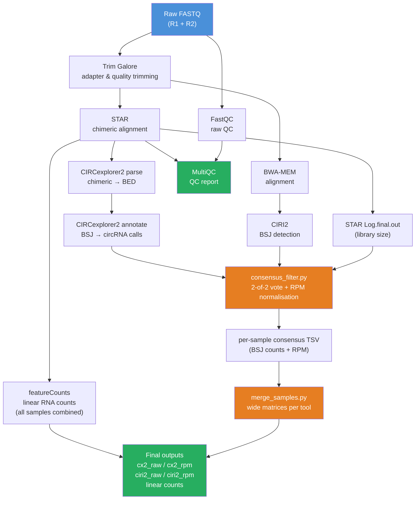

# circs2 — Circular RNA Detection & Quantification Pipeline

A reproducible Snakemake pipeline for the detection, consensus filtering, and quantification of circular RNAs (circRNAs) from paired-end rRNA-depleted RNA-seq data. Two independent detection tools — **CIRCexplorer2** and **CIRI2** — are run in parallel, and only circRNAs called by both (2-of-2 consensus) are retained. Linear gene expression is quantified in parallel using featureCounts for downstream comparison and differential expression analysis.

---

## Table of Contents

- [Overview](#overview)
- [Pipeline DAG](#pipeline-dag)
- [Tools & Dependencies](#tools--dependencies)
- [Repository Structure](#repository-structure)
- [Configuration](#configuration)
- [Running the Pipeline](#running-the-pipeline)
- [Output Files](#output-files)
- [Downstream R Analysis](#downstream-r-analysis)
- [Citations](#citations)

---

## Overview

circRNA detection from short-read RNA-seq data is prone to false positives. Each detection tool uses a different alignment strategy and back-splice junction (BSJ) identification algorithm, so requiring independent confirmation from two tools substantially reduces the false discovery rate without dramatically sacrificing sensitivity.

**Two parallel detection branches:**

| Branch | Aligner | Detection tool | Key feature |
|---|---|---|---|
| CIRCexplorer2 | STAR (chimeric mode) | CIRCexplorer2 annotate | Exon-aware annotation, ciRNA support |
| CIRI2 | BWA-MEM | CIRI2 (Perl) | MLE-based BSJ filtering, repetitive region handling |

After per-sample detection, a **2-of-2 consensus filter** keeps only circRNAs present in both outputs, then normalises BSJ counts to **RPM** using the STAR-reported uniquely mapped read count as the library size denominator. Linear gene expression is quantified from the STAR BAM using featureCounts (all samples in a single combined matrix).

Quality control is collected by MultiQC across all STAR alignment logs.

---

## Pipeline DAG



---

## Tools & Dependencies

All environments are managed per-rule via conda (see `envs/`). No manual tool installation is required.

| Tool | Version used | Purpose | Environment |
|---|---|---|---|
| Snakemake | ≥ 7.0 | Workflow management | base |
| FastQC | any | Raw read QC | `envs/qc.yaml` |
| Trim Galore | 0.6+ | Adapter & quality trimming | `envs/qc.yaml` |
| STAR | 2.7+ | Chimeric RNA-seq alignment (CX2 branch) | `envs/star.yaml` |
| BWA-MEM | 0.7+ | DNA-mode alignment (CIRI2 branch) | `envs/bwa.yaml` |
| CIRCexplorer2 | 2.3+ | circRNA parsing & annotation | `envs/circexplorer2.yaml` |
| CIRI2 | 2.0.6 | circRNA BSJ detection | `envs/ciri2.yaml` (auto-downloaded) |
| featureCounts | 2.0+ | Linear gene expression counts | `envs/featurecounts.yaml` |
| MultiQC | 1.14+ | Aggregated QC report | `envs/qc.yaml` |
| Python ≥ 3.9 | — | Consensus filter & merge scripts | `envs/python.yaml` |
| pandas | — | Data manipulation in scripts | `envs/python.yaml` |

### Reference files required

| File | Config key | Notes |
|---|---|---|
| Genome FASTA | `genome_fasta` | Used by STAR, BWA, CIRCexplorer2, CIRI2 |
| STAR index | `star_index` | Pre-built with `--chimSegmentMin 10` recommended |
| BWA index | `bwa_index` | Prefix path (e.g. `refs/hg38.fa`) |
| GTF | `gtf` | Used by STAR sjdb, featureCounts, CIRI2 |
| genePred / refFlat | `gene_pred` | Required by CIRCexplorer2 annotate |

---

## Repository Structure

```
circs2/
├── Snakefile                   # Main workflow definition
├── config.yaml                 # User configuration
├── samplesheet.csv             # Sample metadata (sample, fastq_r1, fastq_r2)
├── scripts/
│   ├── consensus_filter.py     # Per-sample 2-of-2 vote + RPM normalisation
│   └── merge_samples.py        # Merge per-sample TSVs into wide matrices
├── envs/
│   ├── qc.yaml                 # FastQC, Trim Galore, MultiQC
│   ├── star.yaml               # STAR
│   ├── bwa.yaml                # BWA, samtools
│   ├── circexplorer2.yaml      # CIRCexplorer2
│   ├── ciri2.yaml              # Perl + dependencies for CIRI2
│   ├── featurecounts.yaml      # subread / featureCounts
│   └── python.yaml             # Python, pandas
├── resources/
│   └── CIRI2.pl                # Downloaded automatically on first run
└── analysis/
    └── circRNA_analysis_guide.md   # Downstream R analysis guide
```

---

## Configuration

Edit `config.yaml` before running:

```yaml
samplesheet: "samplesheet.csv"
output_dir:  "results"

# Reference paths
genome_fasta: "/path/to/hg38.fa"
star_index:   "/path/to/STAR_index/"
bwa_index:    "/path/to/hg38.fa"      # BWA index prefix
gtf:          "/path/to/gencode.v44.gtf"
gene_pred:    "/path/to/hg38_refFlat.txt"

# Optional tuning
ciri2_min_reads:      2       # minimum BSJ reads for CIRI2 (default: 2)
min_bsj:              2       # minimum BSJ reads in final merge (default: 2)
featurecounts_strand: 2       # 0=unstranded, 1=forward, 2=reverse
star_extra:           ""      # extra STAR flags
trim_galore_extra:    ""      # extra Trim Galore flags
featurecounts_extra:  ""      # extra featureCounts flags
```

**Samplesheet format** (`samplesheet.csv`):

```csv
sample,fastq_r1,fastq_r2
ctrl_1,/data/ctrl_1_R1.fastq.gz,/data/ctrl_1_R2.fastq.gz
ctrl_2,/data/ctrl_2_R1.fastq.gz,/data/ctrl_2_R2.fastq.gz
treat_1,/data/treat_1_R1.fastq.gz,/data/treat_1_R2.fastq.gz
```

---

## Running the Pipeline

### Dry run (recommended first)

```bash
snakemake --use-conda --cores 8 -n
```

### Full run (local)

```bash
snakemake --use-conda --cores 16
```

### Cluster / SLURM

```bash
snakemake \
  --use-conda \
  --executor slurm \
  --default-resources slurm_account=myaccount \
  --jobs 50
```

### Generate a visual DAG for your dataset

```bash
snakemake --dag | dot -Tsvg > dag.svg
```

---

## Output Files

### Final matrices (ready for R)

```
results/final/
├── cx2_raw.tsv        # CIRCexplorer2 BSJ counts  (circRNAs × samples)
├── cx2_rpm.tsv        # CIRCexplorer2 RPM          (circRNAs × samples)
├── ciri2_raw.tsv      # CIRI2 BSJ counts           (circRNAs × samples)
└── ciri2_rpm.tsv      # CIRI2 RPM                  (circRNAs × samples)

results/featurecounts/
└── all_samples_linear.counts.txt   # Linear gene counts, all samples combined
```

### Per-sample consensus files

```
results/consensus/{sample}/{sample}_consensus.tsv
```

One row per consensus circRNA per sample. Columns:

| Column | Description |
|---|---|
| `sample` | Sample identifier |
| `coord` | `chr:start-end:strand` (0-based start, BED-style) |
| `chrom`, `start`, `end`, `strand` | BSJ coordinates |
| `geneName` | Host gene (from CIRCexplorer2 annotation) |
| `circType` | `circRNA` or `ciRNA` |
| `cx2_BSJ` | BSJ read count from CIRCexplorer2 |
| `ciri2_BSJ` | BSJ read count from CIRI2 |
| `total_mapped` | Uniquely mapped reads (STAR `Log.final.out`) |
| `cx2_RPM` | CIRCexplorer2 BSJ normalised to RPM |
| `ciri2_RPM` | CIRI2 BSJ normalised to RPM |
| `mean_RPM` | Mean of `cx2_RPM` and `ciri2_RPM` |

> **RPM formula:** `RPM = (BSJ_reads / total_uniquely_mapped_reads) × 10⁶`
>
> The denominator is deliberately the **total uniquely mapped read count** from STAR (i.e. the full linear library size), not the circRNA BSJ total. This puts circRNA abundance on a scale directly comparable to linear RPM values from featureCounts.

### QC

```
results/multiqc_report.html    # Aggregated QC across all samples
results/qc/                    # Per-sample FastQC reports
results/logs/                  # Per-rule log files
```

---

## Downstream R Analysis

A complete R analysis guide is provided in `analysis/circRNA_analysis_guide.md`. It covers:

1. **Data loading** — reading all consensus TSVs, building RPM matrices per tool, loading featureCounts linear counts
2. **QC** — detection count plots, RPM distribution boxplots, circRNA vs linear correlation, inter-tool RPM concordance, unsupervised heatmap
3. **Cross-dataset comparison** — host gene linear expression vs circRNA output, side-by-side PCA across all four datasets
4. **Differential expression** — DESeq2 on raw BSJ counts (separately per tool and for linear RNA), volcano plots, top-500 DE heatmaps, inter-tool concordance plot, high-confidence DE circRNA table

---

## Citations

If you use this pipeline, please cite the following tools:

**Workflow management**

> Mölder F, Jablonski KP, Letcher B, et al. Sustainable data analysis with Snakemake. *F1000Research* 2021, **10**:33. https://doi.org/10.12688/f1000research.29032.2

**Quality control & trimming**

> Andrews S. FastQC: a quality control tool for high throughput sequence data. Available at: https://www.bioinformatics.babraham.ac.uk/projects/fastqc/

> Krueger F, James F, Ewels P, et al. Trim Galore (v0.6.7). Zenodo, 2021. https://doi.org/10.5281/zenodo.5127899

> Ewels P, Magnusson M, Lundin S, Käller M. MultiQC: summarize analysis results for multiple tools and samples in a single report. *Bioinformatics* 2016, **32**(19):3047–3048. https://doi.org/10.1093/bioinformatics/btw354

**Alignment**

> Dobin A, Davis CA, Schlesinger F, et al. STAR: ultrafast universal RNA-seq aligner. *Bioinformatics* 2013, **29**(1):15–21. https://doi.org/10.1093/bioinformatics/bts635

> Li H. Aligning sequence reads, clone sequences and assembly contigs with BWA-MEM. *arXiv* 2013. https://arxiv.org/abs/1303.3997

**circRNA detection**

> Zhang X-O\*, Dong R\*, Zhang Y\*, et al. Diverse alternative back-splicing and alternative splicing landscape of circular RNAs. *Genome Research* 2016, **26**:1277–1287. https://doi.org/10.1101/gr.202895.115 (**CIRCexplorer2**)

> Gao Y, Zhang J, Zhao F. Circular RNA identification based on multiple seed matching. *Briefings in Bioinformatics* 2018, **19**(5):803–810. https://doi.org/10.1093/bib/bbx014 (**CIRI2**)

> Gao Y, Wang J, Zhao F. CIRI: an efficient and unbiased algorithm for de novo circular RNA identification. *Genome Biology* 2015, **16**:4. https://doi.org/10.1186/s13059-014-0571-3 (**CIRI, original**)

**Linear quantification**

> Liao Y, Smyth GK, Shi W. featureCounts: an efficient general purpose program for assigning sequence reads to genomic features. *Bioinformatics* 2014, **30**(7):923–930. https://doi.org/10.1093/bioinformatics/btt656

---

## Notes on design choices

**Why 2-of-2 consensus?** Independent benchmarking studies have consistently shown that agreement between CIRCexplorer2 (STAR-based, exon-annotation-guided) and CIRI2 (BWA-based, alignment-score-filtered) yields a high-precision circRNA set. Both tools have orthogonal failure modes: CIRCexplorer2 tends to miss novel unannotated junctions; CIRI2 is more susceptible to false positives from repetitive regions. Requiring both to agree trades a modest reduction in sensitivity for a substantial increase in specificity — appropriate for downstream differential expression analysis where false positives inflate the multiple-testing burden.

**Why STAR uniquely mapped reads as RPM denominator?** Using the total library size (rather than total BSJ reads) anchors circRNA RPM to the same scale as linear RPM from featureCounts, enabling direct ratio comparisons. Using total BSJ reads as denominator would conflate normalisation with detection rate, making cross-sample comparisons unreliable.

**Why DESeq2 for circRNA DE?** BSJ read counts are count data with overdispersion — the same statistical properties that make DESeq2 appropriate for linear RNA apply here. The key assumption is that the size factor can be estimated from the count matrix; with typical sample sizes (≥ 4 per group) and after the 2-of-2 filter, this is satisfied. The alternative — using RPM with a t-test — is not recommended as it discards count uncertainty and violates normality assumptions for lowly expressed circRNAs.

